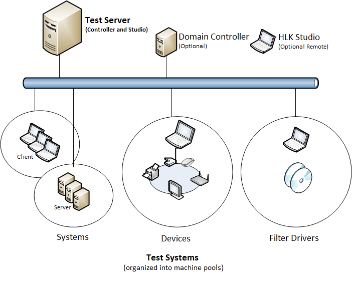
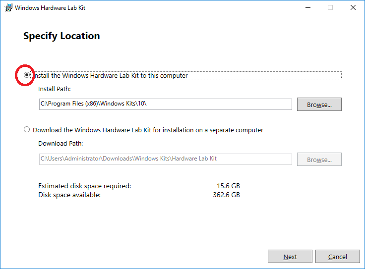
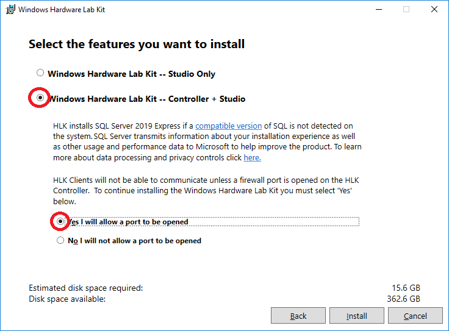
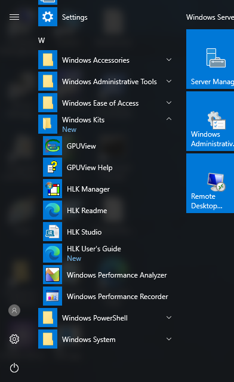
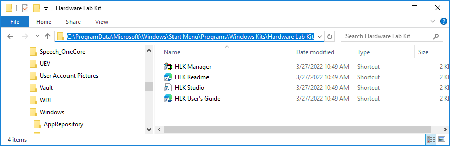
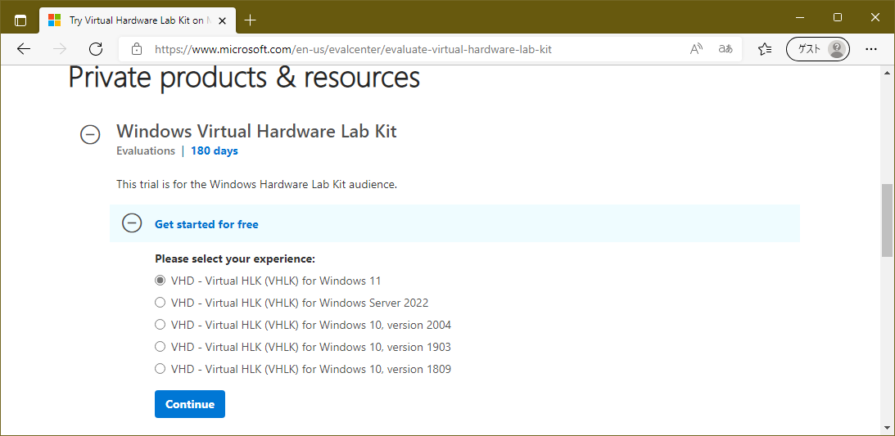
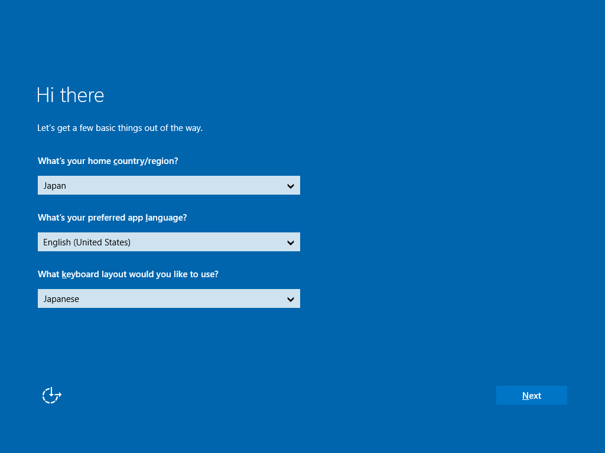
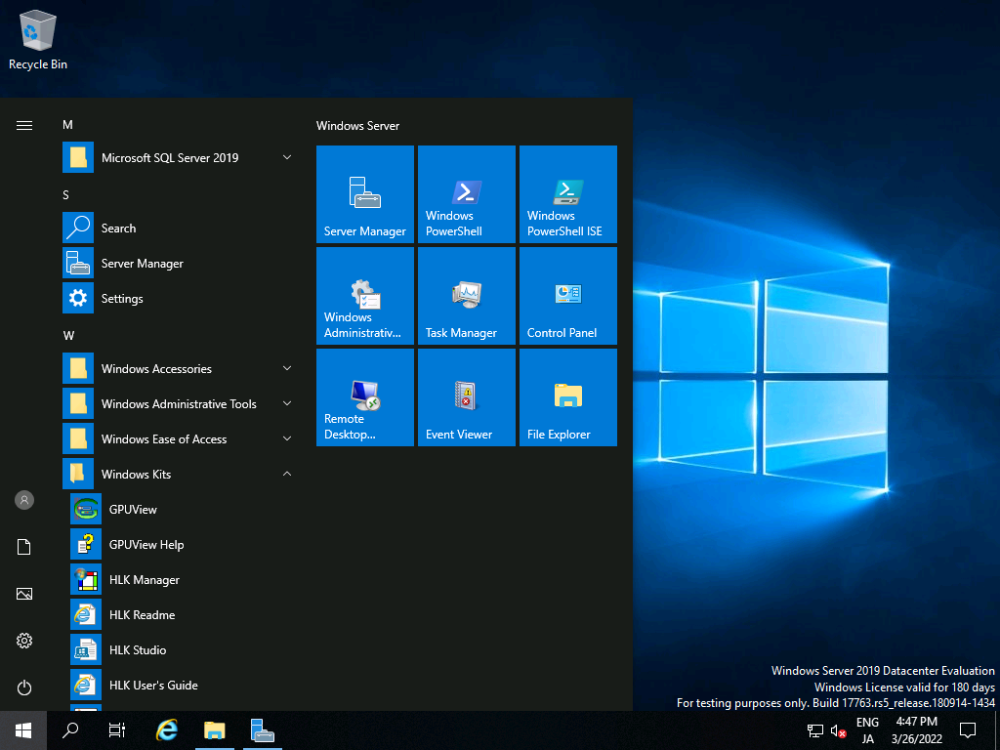

# WindowsDriverTestHowto  (README-ja.md)

Windows ドライバーテスト環境のインストールと使い方（Windows 11 対応）

[https://ahidaka.github.io/WindowsDriverTestHowto/](https://ahidaka.github.io/WindowsDriverTestHowto/)

[English version](README-en.md) -- 現在未製作

## はじめに

Windows用周辺機器やドライバー開発の際、しばしば課題と言われるのが HLK (Windows Hardware Lab Kit)と呼ぶ、ハードウェアデバイスやドライバーのテスト実施です。テスト専用の実行環境を準備して、テストの実行も最低2台の専用PCを必要として、終了まで早くて一晩かかるという、割と大掛かりな作業だからです。

その昔、Windows Logo や WHQL (Windows Hardware Quality Laboratry) の Microsoftの部署（または場所）名として一般に言われていた Microsoft が付与するドライバー署名は、現在では形と運用方針が変わりました。現在では申請者団体の存在を確認できるEV証明書があれば、テスト実行無しで誰でも取得できる構成証明書署名(Attestation Signing) に、実質的に置き換えられました。従来のWindows Logo 製品リストやハードウェア互換性リストはWindows ハードウェア互換性プログラムに進化しました。

そして現在では、以前のLogo Test や WHQLテストは Windows Hardware Lab Kit (HLK) に引き継がれました。
勿論以前と同様に HLK をPASSするとMicrosoft署名を得ることが出来ますが、それにはEV証明書も必要なため、HLK実施はドライバー署名のオプション的な扱いになりました。その代わりに最近では、これまでを引き継ぐHLKの入念で確実なテスト内容から、署名取得の目的ではなくテストをPASSする事だけを目的として、ベンダー各社で実施される様になって来ました。
つまり HLK (Hardware Lab Kit)は、ドライバー署名とは切り離して、純粋にハードウェアデバイスやドライバーのテスト環境として採用される様になりました。

ここでは Windows 11 を主なテスト対象（ターゲット）として、最低限の WLK を実施する方法と手順を示します。

### 参考文献

Microsoft から以下の参考文献が公開されていますが、わかり難い面があるため以降は随時補足しながら説明します。

Windows Hardware Lab Kit
https://docs.microsoft.com/ja-jp/windows-hardware/test/hlk/

HLKは従来からのTest Kit同様、英語版Windows ServerにControlerとStudioをインストールする方法に加えて、VHLK による仮想マシンによる配布も行われています。個別インストールが必要な、HLKについて説明します。

### 必要な環境

Windows 11とWindows Server 2022のリリースにより、現在のHLKは環境移行の途中にあります。
つまりテスト対象(ターゲット) のOS種類によって、HLKが異なるものを用意する必要があります。
またHLK実行を管理するホスト環境の構築を助けるため、Windows 11 のリリースに合わせて、以前のOSも含めたいくつかのテスト環境用仮想ディスクイメージが用意される様になりました。

HLKの実施には、<strong>コントローラ</strong> と <strong>Studio</strong> と <strong>クライアント</strong> が必要です。コントローラとStudio は同一マシンに搭載（インストール）できますが、OSは必ず英語版の Windows Server (x64) を用意する必要があります。以下の図では Test Server として表示しています。クライアントはテスト対象マシンそのものです。以下の図では Client として示しています。ドメインコントローラーは無くても構いません。Workgroup 環境でもテストを実行可能です。

必要な環境をテスト対象別に整理します。

ホスト(サーバー側)

実行するHLKの作成日付（＝テスト対象）によって異なります。

- 以前のHLK (テスト対象Windows 10, Windows Server 2016)
  Server 環境：Windows Server 2012, Windows Server 2012 R2, Windows Server 2016 いずれか（英語版 Std.必須）
  または VHLK

- 新しい HLK（Windows 11, Windows Server 2022）
  Server 環境：Windows Server 2016, Windows Server 2019 いずれか（英語版 Std.必須）
  または VHLK

https://docs.microsoft.com/ja-jp/windows-hardware/test/hlk/

https://docs.microsoft.com/ja-jp/windows-hardware/test/hlk/getstarted/windows-hlk-prerequisites

に詳細が記載されていますが、分かり易い様整理しました。
重要な事は Windows 10 用HLK環境での Windows 11 のテストなど、環境が合致しない場合はテストを開始出来ません。

以降はWindows 11用の新しい HLK環境を構築する事例を紹介します。
Windows 10 用環境の場合は、サーバーOSとインストールで使用するHLKが異なるだけで、手順は同じです。

## HLK 環境の構築

英語　Windows Server 2016 std をサーバーの例にして、HLK 環境を構築してインストールする手順を示します。準備として 英語版 Windows Server 2016 Std., 英語版 Windows Server 2019 Std. のいずれかをインストールして、Windows Updateで最新版にしておきます。さらに以下のページから 使用するHLK をダウンロードしておきます。HLK はどのバージョンもファイル名が HLKSetup.exe と同じのため、複数使い分ける場合はダウンロード後ファイル名を変えておく必要があります。今回の例は Windows 11をターゲット（クライアント＝テスト対象）としたテストを行うため、Windows 11 HLK をダウンロードします。

HLKのダウンロードページ
https://docs.microsoft.com/ja-jp/windows-hardware/test/hlk/

注意点として、Windows 11 HLKの場合は SQL Server 2019 を自動でインストールして使用します。
インストール先ですでに古いHLKを利用するなどして、古いSQL Server 2019以外のSQL Serverがインストールしてある場合は、事前に関連するソフトウェアを全てアンインストールしておきます。Windows 10 用HLK等のインストールでは、SQL Server 2019を使用しないので、古いSQL Serverのアンインストールは不要です。

HLKをダウンロードした後は HLKSetup.exe を起動します。
起動後 Install the Windows Hardware Lab Kit to this computer を選択します。

続いて Windows Hardware Lab Kit -- Controller + Studio を選択します。
クライアントとコントローラーの通信に使用するIPポートを開くため、
「Yes I will allow a port to opend」をチェックします。

**Install** でインストールを開始します。

インストールが完了するとスタートメニューの **Windows Kits** 以下に **HLK Studio** のアイコンが登録されます。

HLK Studioは、C:\ProgramData\Microsoft\Windows\Start Menu\Windows Kits 以下からも起動可能です。

## VHLK 環境の構築

VHLK 環境を構築してインストールする手順を示します。

VHLK 環境は予めHLKインストール済の仮想マシンを利用するため、インストールの手間と時間を省くことが出来、また運用次第では1台で複数のサーバーを実現することも出来ます。しかし下記参考文献の通り、サーバーにはより多くのリソースが推奨環境として求められます。

- 8コア、SLAT 対応の 64ビット プロセッサ
- 8GB RAM
- BIOS/UEFI で有効な仮想化をサポート
- 120GB HDD の空き領域

基本的には以下の参考文献（セットアップガイド）の通りに進めるだけで、日本語 Windows 10 pro をホスト環境にして構築出来ます。読み込ませる仮想ハードディスクは以下からダウンロードして入手しておきます。

https://www.microsoft.com/en-us/evalcenter/evaluate-virtual-hardware-lab-kit

Hyper-Vで作成仮想マシンを作成する前に、外部仮想スイッチを作成するか設定済を確認します。その後ダウンロードしたVHDXを既存の仮想ハードディスクとして使用するだけで、構築完了です。

### 参考文献

https://docs.microsoft.com/ja-jp/windows-hardware/test/hlk/getstarted/getstarted-vhlk

### 起動後の手順

仮想マシン起動後は、次の様な環境設定画面が表示されます。以下の様に、英語のまま場所を日本、日本語キーボードの設定で問題無く動作します。

参考文献ではドメイン参加を前提に説明していますが、単体HLKと同様にWORKGROUPでも動作します。

180日間のライセンス認証条件を確認するとログイン可能です。最初は、Administratorアカウントのパスワード入力を求められます。Administrator アカウントはHLKテストでは使用しません。

次にHLKテストで使用する　HLKAdminUser アカウントを選択すると、パスワード設定を求められます。これで設定完了です。

### テスト準備

以降は、HLKでもVHLKでも同様に下記「手順 2:テスト システムへのクライアントのインストール」から始めることが出来ます。

[手順 2: テスト システムへのクライアントのインストール](https://docs.microsoft.com/ja-jp/windows-hardware/test/hlk/getstarted/step-2--install-client-on-the-test-system-s-)

https://docs.microsoft.com/ja-jp/windows-hardware/test/hlk/getstarted/step-2--install-client-on-the-test-system-s-

以上。